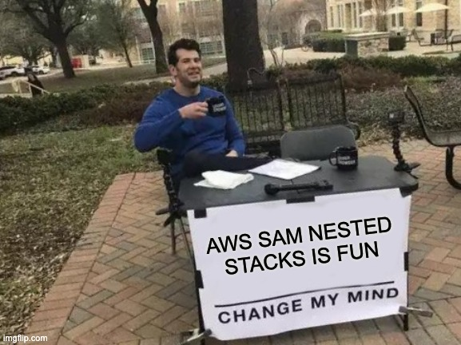

# My Experience Created AWS SAM to build Pipeline to Deploy AppRunner

**Date: 1 September 2024.**. 

## Objective
I have multiple AppRunner in AWS. Currently, I deploy it manually. I plan to build AWS CodePipeline to make it done
automatically.

Of course, since I have multiple apps stacks, I prefer not to manage each pipeline manually, because of so, AWS SAM is
the best solution.

My experience conclusion so far with AWS

### Tried using AWS nested stacks
The reason I'm trying using nested stacks is that SAM pipeline alone config is so long that even took **54 lines**

So I'm thinking, if I splice this into multiple nested stacks, it will be more manageable.

Finding out nested stacks makes it harder because of two reasons:
1. When error happened, it’s not clear what is the cause of the errors because it happens on child stack.
2. Slower to update stacks, as it even triggers update child stack that is not even updated.

**Conclusion:**   
I back to use SAM single stack. Fast and efficient.   
I'm willing to trade long lines for speed and simplicity. 

### I Learnt how to CodeDeploy AppRunner
CodeDeploy by default did not support to deploy to AppRunner. To do this, I end up using Invoke Lambda.

It involves in the build process it will push new Docker Image tag to AWS ECR and save the image name as artifact.

CodeDeploy Lambda then read the artifact to know the image name, inside Lambda, I use AWS SDK AppRunner to update the 
config and use this image tag.

Deployment runs quite fast for me, in total less than 5 minutes.

1. AWS CodeBuild, which builds the Docker Image, took two minutes
2. AWS CodeDeploy, which invoking Lambda took two minutes.

### Watch out, Lambda must report to CodePipeline
I'm using CodeDeploy v2 which we pay based on how long the pipeline ran.

If I use Lambda, I found the Lambda **MUST report back** to CodePipeline if the job success or failed from context. Just
throwing exception won't do. If I miss this, I could make me over-billed.

### Setup AWS ECR image rule
Since I build Docker image for every PR merged to the main branch. I will have a lot of Docker images in ECR and could
cause over-bill.

Because of so, I set up a rule to just save the latest 10 Docker Images for deployment, which should be more than enough
in case I need to roll back the deployment.

### Next step
1. I have a DB migration script that needs to run after AppRunner updated, need to a way to trigger this. 
2. I remember AppRunner maybe dispatching an event in EventBridge.

### Closing
If you are interested to know how, I configure it with source code and explanation. Please let me know in comment, I will
find time to share it and make a video for it.